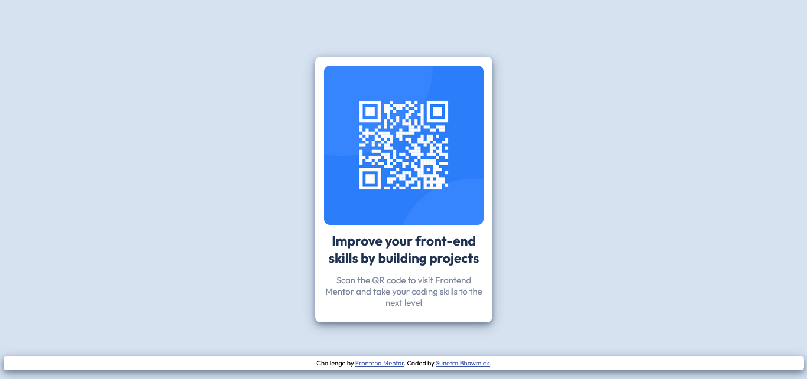

# Frontend Mentor - QR code component solution

This is a solution to the [QR code component challenge on Frontend Mentor](https://www.frontendmentor.io/challenges/qr-code-component-iux_sIO_H).

## Table of contents

- [Overview](#overview)
  - [Screenshot](#screenshot)
  - [Links](#links)
- [My process](#my-process)
  - [Built with](#built-with)
  - [What I learned](#what-i-learned)
  - [Continued development](#continued-development)
  - [Useful resources](#useful-resources)
- [Author](#author)

## Overview

### Screenshot



### Links

- Solution URL: [QR-Code-Challenge](https://github.com/kaiser-sb/QR-Code-Challenge.git)
- Live Site URL: [QR Code Card](https://your-live-site-url.com)

## My process

### Built with

- Semantic HTML5 markup
- CSS custom properties
- Flexbox


### What I learned

While building this project, I revisited important CSS concepts like box model, position and flexbox and put together a combination of those to build this card. This is the first time I am using UI kit for specifications and colour pallets so that was a nice experience.

One point I struggled with, was to align my main container vertically, which was relatively positioned. Through various experiments I finally resorted to using this fix -

```css
.table {
    display: table;
    width: 100%;
    height: 100%;
}

.table-cell {
    display: table-cell;
    vertical-align: middle;
}
```

### Continued development

As an aspiring developer, I am keen to focus more on different CSS stylings and incorporate concepts like CSS grid - which I am still not very comfortable with. In future, I plan to build interactive front-end projects involving JavaScript and React.

### Useful resources

- [FreeCodeCamp](https://www.freecodecamp.org/learn) - This is one of the best resources I have ever found while continuing my journey. I recommend it to anyone who is just starting out and want to be a self-taught developer.
- [W3Schools](https://www.w3schools.com/css/css_positioning.asp) - This is an amazing article which helped me revisit the concepts of div positioning. A wonderful resource to consult any time.

## Author

- GitHub - [@kaiser-sb](https://github.com/kaiser-sb)
- Frontend Mentor - [@kaiser-sb](https://www.frontendmentor.io/profile/kaiser-sb)
- LinkedIn - [Sunetra Bhowmick](https://www.linkedin.com/in/kaiser-sb/)

